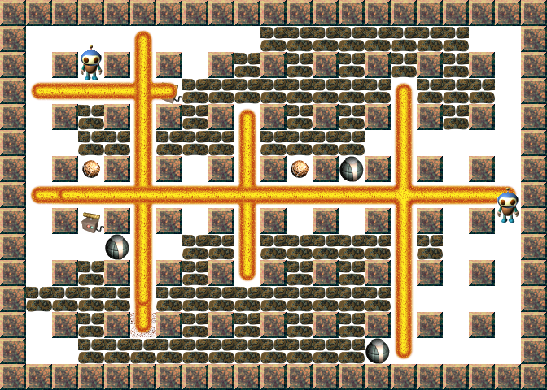

# bomberman-sfml
Local multiplayer Bomberman game. Developped in C++ using SFML.
Credit goes to Lionel Baboud for the visual assets.

# Game
Bomberman is a 2D multiplayer game. Each player controls an avatar able to move fast and put bombs. The bombs can destroy the environment, the bonuses or kill the opponent. What you want is to kill your adversary before he does.

# Compilation
A Makefile is placed add the root of the repository. This Makefile expects SFML to be installed on the machine (typically, package libsfml-dev).

# Custom maps
The map is stored in the rc/map.bmp file. This file can be edited for custom maps.

# Bonuses
There are 3 kinds of bonuses:
* bomb bonus: allows to use one more bomb at the same time
* blast: makes bombs more powerfull
* remote: gives the ability to choose when bombs explodes

# Key bindings
Player 1 keys:
* movement: Z Q S D
* put bomb: A
* use remote: E

Player 2 keys:
* movement Up Left Down Right arrows
* put bomb: L
* use remote M
